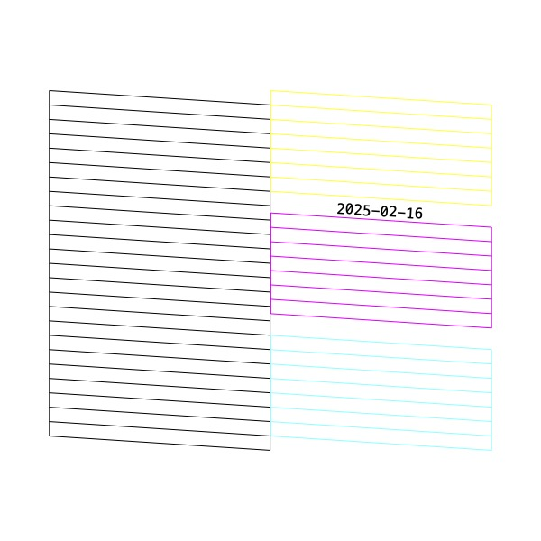

# Automated Print Script
The postscript file tries to replicate the EPSON EcoTank alignment print pattern but printed in a different spot each time. 4x7 = 28 patterns per page, 56 per sheet for DIN A4. (One year can have a maximum of 53 weeks.)

The bash script will be called by home assistant automation.
It updates the date and print number in the postscript file to align the print pattern. And then prints it.
```ps
/NTH 18 def % nth print
/DATESTRING (2025-02-16) def
```
Works with home assistant shell response.

## Setup
The Home Assistant Docker Image does not include the `lp/cups` command.

So: Home Assistant Docker Container -> SSHs into RaspberryPi OS -> executes script -> prints.

For that to work without a password we need a ssh private key inside the docker container, and the public key in Raspberry Pi's authorizedKeys file.

```bash
ssh <user>@<host>	# to Raspberry Pi
cd <config>/custom_resources
git clone 'https://github.com/amaider/auto_clean_print.git'
cd auto_clean_print

docker ps -a
docker exec -it <container-name> /bin/bash	# open shell in home assistant container
mkdir -p /root/.ssh
cd /root/.ssh
ssh-keygen -t ed25519 -f /root/.ssh/id_ed25519 -N '' -C "Home Assistant Docker Container"
ssh-copy-id <user>@127.0.0.1
exit	# docker shell
exit	# RaspberryPi ssh shell
```

### Home Assistant `configuration.yaml`
Get printer name with ```$ lpstat -e```.

Update full config directory path from root (/home/<full_path>/config/). 

Print format and width/height are optional (default DIN A4).
```yaml
shell_command:
    auto_clean_print_cmd: 'ssh pi@127.0.0.1 <config_path>/custom_resources/auto_clean_print/auto_clean_print.sh -d <printer_name> [-o "media=a4" -w 595.28 -h 841.89]'
```
```yaml
shell_command:
    auto_clean_print_cmd: >
        ssh pi@127.0.0.1
        <config_path>/custom_resources/auto_clean_print/auto_clean_print.sh
        -d <printer_name>
        [-o "media=a4" -w 595.28 -h 841.89]
```

#### Calculating Page Size Points (currently DIN A4)
``` ps
% Page Size: 72points -> 1 inch
/PAGE_W 595.28 def
/PAGE_H 841.89 def
```

## Alignment Pattern:
The pattern is 1.33 inches high, which is also the EPSON PrecisionCore print head height. That should mean that all nozzles will be used in one print head pass. This postscript is a 'handmade' copy, as close as possible to the original alignment pattern.
